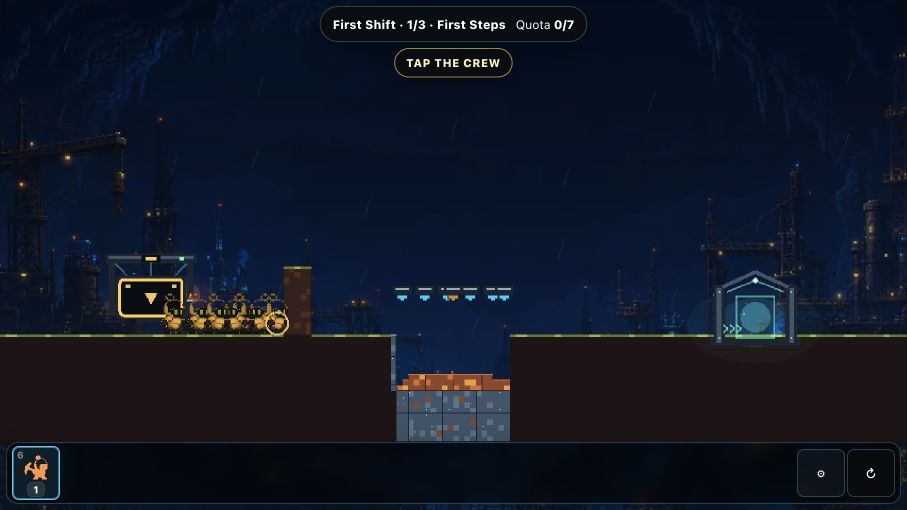
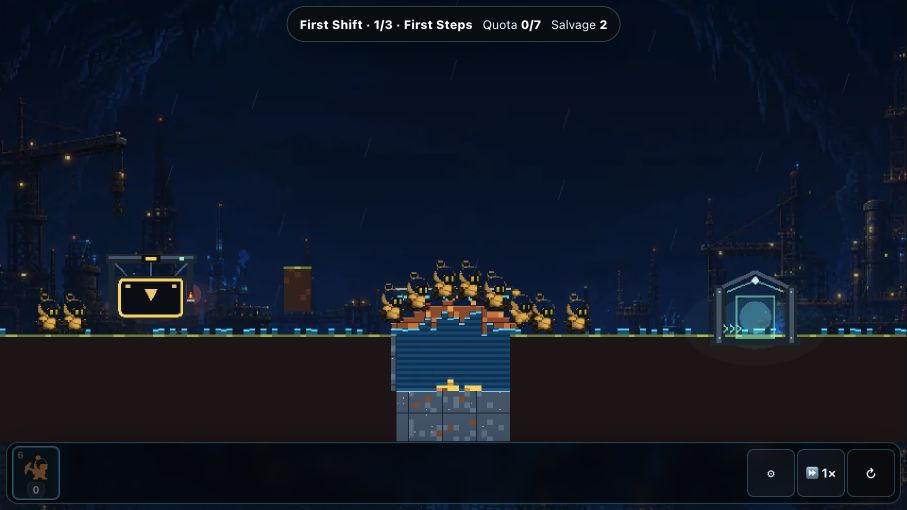
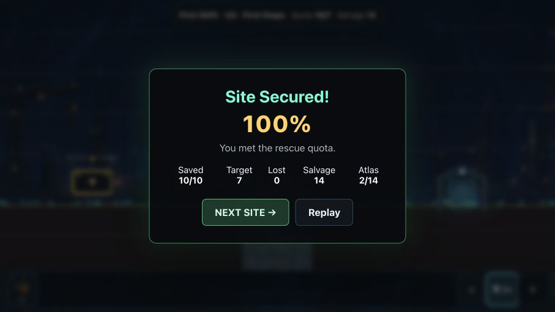
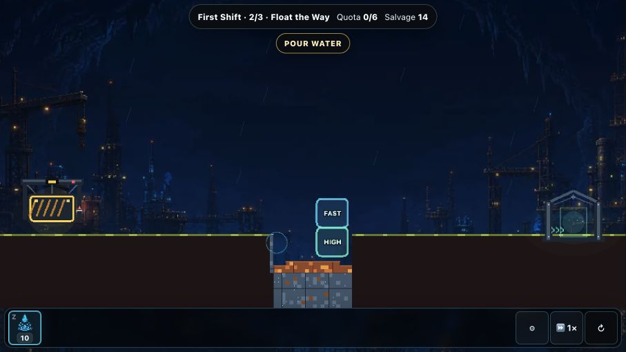
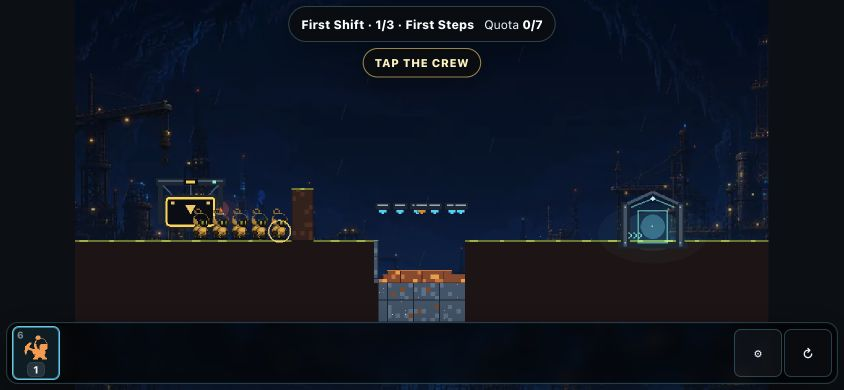
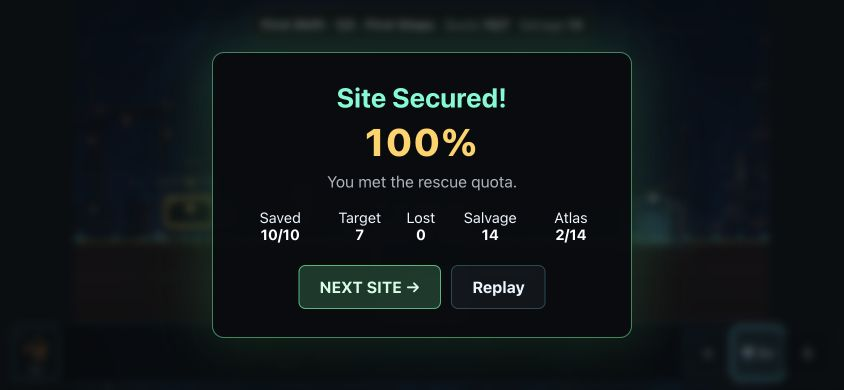
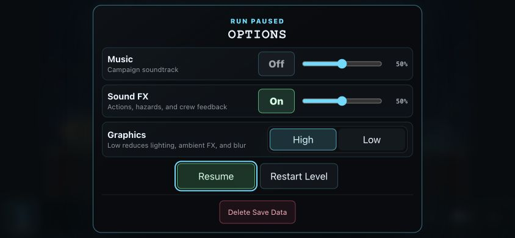

# Swarmwright portal product — adversarial review

- **Date:** 2026-08-20
- **Scope:** compiled first Expedition entry, first command, terrain payoff,
  result/continuation, Site 2 choice, responsive layout, and pause/recovery
- **Audit mode:** combined UX, browser-game, accessibility-risk, and
  release-claim review
- **Verdict:** **INTERNAL GO / MARKET EVIDENCE OPEN / PUBLIC RELEASE NO-GO**

The current player flow maps well to CrazyGames' controllable success levers.
No new internal blocker or major gameplay regression was found. The largest
reproducible gap was documentation drift: active-looking plans still described
retired build variants, a retired branch, missing SDK work, old artifact hashes,
and pre-merge state. This pass makes the current product/delivery contract
canonical and labels dated plans as history.

## Flow evidence

### 1. First actionable frame — healthy

The game lands directly in motion with one instruction, one available tool, a
marked crew target, a visible obstacle, and a visible exit. Play outranks chrome.

### 2. Command and terrain reaction — healthy

The accepted action removes the cue, consumes the Basher, reveals Salvage, and
produces a readable water/timber crossing. The flow is responsive and the
material payoff remains the visual focus.

### 3. Result and continuation — healthy

The result is compact, names success, shows the rescue outcome, and gives Next
Site stronger hierarchy than Replay. It does not interrupt the terrain chain
with an earlier full-screen reward.

### 4. Site 2 prediction — healthy

The second Site introduces one new verb and two broad world-space choices. This
is a genuine progression from command causality to predicted material outcome,
not a second modal tutorial.

### 5. Portal-size first frame — healthy with a device-evidence limit

At 844×390, the status, target, crew, obstacle, exit, and bottom controls remain
legible and unobstructed. The 16:9 room is safely pillarboxed inside the wider
viewport. This capture validates responsive composition, not an actual touch
device profile or safe-area inset.

### 6. Portal-size result — healthy

The result fits without scrolling, clipped copy, or ambiguous focus. Both
actions retain practical targets.

### 7. Pause and recovery — healthy

The options surface is a labelled dialog with an obvious focused Resume action,
clear audio/graphics state, restart, and deliberately separated destructive save
control. Gameplay remains visible but subordinate.

All accepted screenshots from this run are stored under
`.artifacts/audits/2026-08-20-portal-alignment/`.

## Strengths

- Zero-click entry and a one-verb cue satisfy the portal-first onboarding shape.
- The first input causes the real deterministic system; it is not a fabricated
  video, timer, or UI-only acknowledgement.
- Site 1 spectacle, Site 2 prediction, and Site 3 route trade-off form a coherent
  teaching ladder backed by solvability guards.
- The HUD stays unusually light for a systems puzzle. Results and pause surfaces
  are semantic DOM rather than canvas-only panels.
- Continuous save, Workshop, Atlas, Daily, and Test Yard create plausible playtime
  and return hooks without blocking the core rescue loop.

## Hostile findings

### Resolved in this pass — MAJOR: active documentation contradicted the build

`CLAUDE.md` referenced a nonexistent `build:crazygames` command. Dated plans
still instructed contributors to create/merge a feature branch and described
separate Basic/Full artifacts or a missing SDK. The current documentation map,
product status, mirrored agent guidance, and supersession banners now prevent
those records from acting like current instructions.

### Open — MAJOR: alignment is not success evidence

The flow supports one-minute conversion, playtime, and D1 retention, but local
automation cannot produce those aggregate outcomes. The only honest pass is
**product-aligned** until CrazyGames Basic Launch supplies live metrics.

### Open — MAJOR: cold-player causality is still unproven

The screenshots show a legible chain, but an informed reviewer cannot certify
that a new player understands why the bridge moved or predicts Site 2 without
coaching. The existing five-player comprehension gate remains the next product
test; another speculative onboarding redesign would be lower-value.

### Open — MAJOR: public identity and rights remain fail-closed

`Swarmwright` is a working name. Unresolved provenance decisions, human
originality/commercial-rights review, and title/confusion review still block a
public release claim and final media approval.

### Open — MAJOR: responsive proxy is not mobile-host proof

The 844×390 capture is a desktop-capability browser at a mobile portal viewport.
It cannot prove touch arbitration, iOS safe areas, the host rotation experience,
thermal behavior, memory, WebGL recovery, Vercel deployment state, or the
CrazyGames/Poki app webviews. The signed device matrix remains mandatory.

### Open — ACCESSIBILITY RISK: the primary world verb is canvas-targeted

The status, tool, result, pause dialog, switches, sliders, and buttons expose
useful semantics and visible focus. The required crew target itself has no DOM
equivalent, so keyboard-only and screen-reader users cannot independently
complete the opening action. Screenshot and DOM inspection cannot establish
full WCAG conformance; contrast, screen-reader announcements, switch/slider
behavior, focus restoration, and zoom resilience still need dedicated testing.

## Decision

No speculative gameplay or visual change is justified by this run. Preserve the
current first-minute flow, close the documentation contradiction, verify the one
artifact and both SDK seams, then move to cold-player, Vercel/mobile, hosted
portal, identity, and provenance evidence. Product revisions should follow the
first observed drop-off—not precede it.
